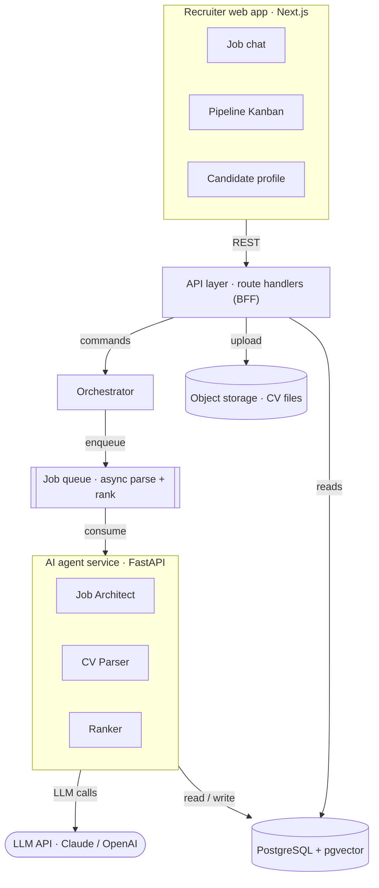

<div align="center">

# Orange

### Your agentic hiring team.

Orange replaces the busywork of recruiting. Describe a role, drop in the CVs, and it reads every one, ranks the shortlist, and shows its work. Sourcing to offer, run by AI.


<br>

<!-- Record a 15 to 30s screen capture of the full loop and save it as docs/demo.gif. This is the hero. -->


</div>

<br>

> **Early prototype.** The core loop works end to end today. Everything under [Roadmap](#roadmap) is where we take it next.

## What it does

You describe the role. Orange does the reading: it parses every résumé into a clean profile, scores each candidate against the job across skills, experience, education, and logistics, and writes out the reasoning behind every ranking. The scores are real and every one is auditable, with the model quoting the exact lines from the CV that justify it. No forms. No keyword filters. No black box.

## How it works

Uploads land on a queue, so ranking runs in the background. The recruiter never waits on the model.



## Roadmap

We start where hiring hurts most and expand until the whole pipeline runs itself.

- [x] Read, score, and rank candidates with reasoning you can act on
- [ ] ATS sync: Greenhouse, Lever, Workday
- [ ] Inbound capture and outbound follow-ups over email and WhatsApp
- [ ] AI first-round interviews, scored and auto-advanced
- [ ] Orange in the room: a live copilot for human technical interviews
- [ ] Sourcing to offer, end to end

**The goal: the hiring team, in software.**

## Stack

Lean now so it ships fast. Built to grow into a stack that scales.

| | Now (prototype) | At scale |
|---|---|---|
| Web | Next.js · TypeScript · Tailwind | Next.js |
| API and services | Next.js route handlers (BFF) | Go services |
| Agents | Python · FastAPI | Python · FastAPI |
| Reasoning | Claude / OpenAI | Claude / OpenAI + tuned models |
| Vector search | Postgres + `pgvector` | dedicated vector DB (Qdrant / Pinecone) |
| Queue and cache | in-process queue | Redis + event stream |
| Data | PostgreSQL | PostgreSQL + read replicas |
| Infra | Vercel · Railway | AWS · Docker · Kubernetes |

## Run locally

**Prerequisites:** Node 22+, [uv](https://docs.astral.sh/uv/), and Docker.

```bash
git clone https://github.com/saadhtiwana/orange.git
cd orange
cp .env.example .env        # add your ANTHROPIC_API_KEY
```

**1. Database** — Postgres with `pgvector`, on port 5432:

```bash
docker compose up -d postgres
```

**2. AI service** — FastAPI on `localhost:8000`:

```bash
cd ai
cp ../.env.example .env     # needs ANTHROPIC_API_KEY
uv sync
uv run uvicorn app.main:app --reload
```

Check it: `curl localhost:8000/health`

**3. Web app** — Next.js on `localhost:3000`:

```bash
cd web
cp ../.env.example .env     # needs DATABASE_URL and AI_SERVICE_URL
npm install
npx prisma migrate deploy   # create the tables
npm run dev
```

Open [localhost:3000](http://localhost:3000) — it lands on the Job Architect. Describe a role and you get a structured job description back, saved to Postgres.

### Working on it

```bash
# web/
npm run lint && npm run format:check && npm run typecheck && npm test && npm run build

# ai/
uv run ruff check . && uv run ruff format --check . && uv run mypy app scripts && uv run pytest
```

CI runs exactly these on every push and PR. Tests mock the LLM, so they need no API key and cost nothing.

After changing a contract in `ai/app/contracts/models.py`, regenerate the artifacts:

```bash
cd ai  && uv run python scripts/export_schemas.py
cd web && npm run gen:contracts
```

See [docs/contracts.md](docs/contracts.md) for what the contracts are and [CONTRIBUTING.md](CONTRIBUTING.md) for the branch and commit conventions.

## Team

[@saahtiwana](https://github.com/saahtiwana) · [@ahmadmustafa02](https://github.com/ahmadmustafa02) · [@abdullahxdev](https://github.com/abdullahxdev)

<sub>© 2026 Orange</sub>
